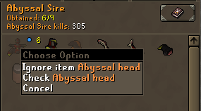
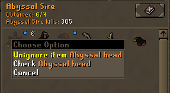
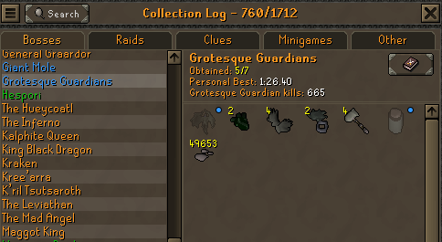
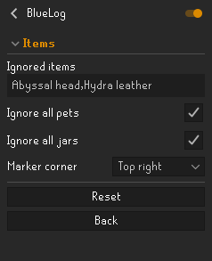

# BlueLog

A RuneLite plugin that colours a Collection Log section **blue** when the only items you are still missing from it are ones you have listed yourself.

## Usage

Right-click an item in the Collection Log to ignore it. Ignored items get a blue marker so you can tell them apart at a glance.

 

Once every item you are still missing from a section is ignored, the section name turns blue.

## Configuration

Ignored items are stored as a comma-separated list, so you can edit them directly. Pets and jars are ignored by default, and the marker corner is configurable.

